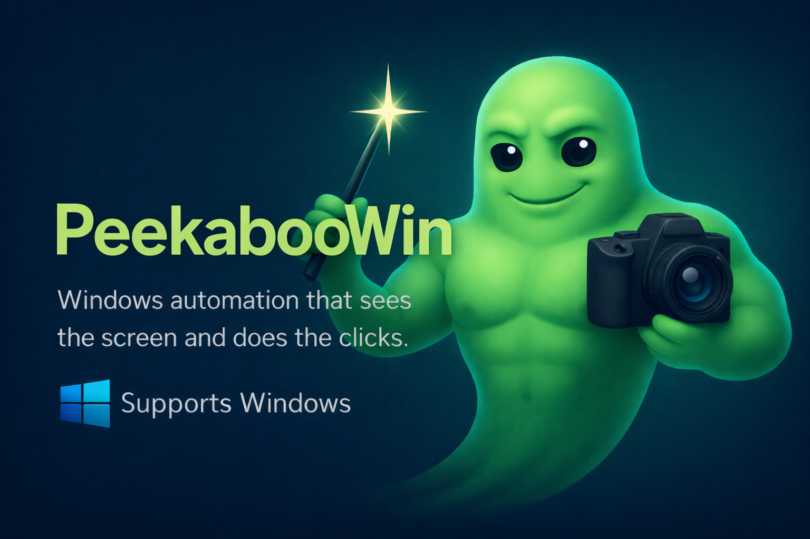

# PeekabooWin

<p align="center">
  
</p>

[](./LICENSE) [](https://nodejs.org/) [](https://www.microsoft.com/windows)

PeekabooWin is a Windows-first desktop automation sidecar inspired by [Peekaboo](https://github.com/steipete/Peekaboo) by Peter Steinberger.

It gives you one automation engine with three ways to use it:

- a single-file Windows sidecar UI for non-technical users
- a local CLI for direct control and workflows
- an MCP server so Claude Code and other AI tools can drive the same desktop actions

PeekabooWin can capture windows and screens, index accessible UI controls, read visible text with OCR (optical character recognition — the same technology that lets your phone scan a document), click or scroll by label, type into apps, manage windows, and harvest long on-screen transcripts into local files that an AI can analyze afterward.

## Super Quick Start

Copy this prompt into Claude Code, Codex, or any AI coding agent:

```text
Clone https://github.com/FelixKruger/PeekabooWin and set it up.
Run npm install, then npm test to verify everything works.
Once tests pass, open a Notepad window with some text in it,
then use the PeekabooWin MCP server to capture and OCR that window.
Show me what PeekabooWin can see.
```

That's it. The repo includes a project `.mcp.json` so the agent picks up PeekabooWin automatically after cloning.

## Credit

This project is directly inspired by Peter Steinberger's Peekaboo.

- Original project: [steipete/Peekaboo](https://github.com/steipete/Peekaboo)
- Peekaboo site: [peekaboo.boo](https://peekaboo.boo)
- Project credit note: [CREDITS.md](./CREDITS.md)

PeekabooWin is not an official port and is not affiliated with Peter's project. It is a Windows-first rewrite of the practical desktop automation loop for people who want a similar workflow on Windows.

## What You Get

- Window and screen capture to PNG
- Structured `see` snapshots with indexed UI Automation controls
- Built-in Windows OCR on captures and snapshots
- Click and scroll by visible label, with OCR fallback when accessibility data is weak
- Menu and standard dialog automation
- Window focus, move, resize, maximize, minimize, and app launch/switch/quit
- Snapshot storage, cleanup, and reusable workflows
- A single-file Windows control pad: `PeekabooWin.hta`
- Higher-level recipes and plain-language goal planning
- A scroll-and-harvest text pipeline for long local threads, logs, and documents
- A project `.mcp.json` so Claude Code can discover the MCP server in this repo

## Current Status

PeekabooWin is a strong Windows MVP with a real automation loop:

1. choose an app or screen
2. capture what is visible
3. find controls and readable text
4. click, scroll, drag, type, or hand the context to an AI

It does not yet cover the full feature surface of macOS Peekaboo. The biggest remaining gaps are richer natural-language planning, deeper Windows system-surface automation, and more polished consent/safety flows around destructive actions.

## Requirements

- Windows
- Node.js 22+
- PowerShell

There are currently no external runtime services required for the local automation engine. OCR uses the Windows runtime already present on the machine.

## Install

Clone the repo and run from the project folder:

```powershell
npm install
npm test
```

Useful entry points:

```powershell
npm run ui
node .\bin\peekaboo-win.js --help
node .\bin\peekaboo-win-mcp.js
```

## Safe First Run

The safest first test is a disposable app like Notepad, not your browser or a work app.

Create a long local file, open it in Notepad, then let PeekabooWin read it:

```powershell
New-Item -ItemType Directory -Force .\exports | Out-Null
1..400 | ForEach-Object { "Message $_" } | Set-Content .\exports\sample-thread.txt
Start-Process notepad.exe .\exports\sample-thread.txt

node .\bin\peekaboo-win.js goal plan --text "scrape this thread" --title "Notepad"
node .\bin\peekaboo-win.js harvest text --title "Notepad" --max-steps 12 --output .\exports\harvested-thread.txt
```

Then inspect the results:

```powershell
Get-Content .\exports\harvested-thread.txt -TotalCount 40
Get-Content .\exports\harvested-thread.json -TotalCount 80
```

## Quick Start

Common commands:

```powershell
node .\bin\peekaboo-win.js windows list
node .\bin\peekaboo-win.js app list
node .\bin\peekaboo-win.js see --mode window --title "Untitled - Notepad"
node .\bin\peekaboo-win.js click --on "Save" --title "Untitled - Notepad"
node .\bin\peekaboo-win.js click --on "OCR TEST 123" --snapshot latest --exact
node .\bin\peekaboo-win.js scroll --on "Items" --snapshot latest --direction down --ticks 2
node .\bin\peekaboo-win.js type --text "hello from PeekabooWin" --clear
node .\bin\peekaboo-win.js menu click --title "Untitled - Notepad" --path "File>Page setup" --exact
node .\bin\peekaboo-win.js dialog click --title "Page setup" --button "OK" --exact
node .\bin\peekaboo-win.js harvest text --title "Notepad" --max-steps 12 --output .\exports\thread.txt
node .\bin\peekaboo-win.js recipe list
node .\bin\peekaboo-win.js goal run --text "scrape this thread" --title "Notepad" --output .\exports\thread.txt
node .\bin\peekaboo-win-mcp.js
```

Artifacts are stored under `%USERPROFILE%\.peekaboo-windows\...` unless you provide an explicit output path.

## Desktop UI

`PeekabooWin.hta` is the non-technical front end.

Why it exists:

- normal Windows users often do not want a CLI
- it is a single file you can keep beside an AI app
- it uses the same engine as the CLI and MCP server

The UI flow is intentionally guided:

1. choose an app or screen
2. take a snapshot
3. review what PeekabooWin found
4. click, type, or hand the same context to an AI

Run it with:

```powershell
npm run ui
```

Or open `PeekabooWin.hta` directly.

## Claude Code

This repo includes a project-scoped `.mcp.json`:

```json
{
  "mcpServers": {
    "peekaboo-win": {
      "type": "stdio",
      "command": "node",
      "args": ["./bin/peekaboo-win-mcp.js"]
    }
  }
}
```

That means Claude Code can pick up PeekabooWin directly when you open this repo.

For a focused setup guide, see [docs/claude-code.md](./docs/claude-code.md).

### How To Use It With Claude Code

1. Open this repo in Claude Code.
2. Approve the `peekaboo-win` MCP server when Claude asks.
3. Ask Claude to use PeekabooWin against a target local app.
4. Let Claude save long harvested text to a file inside the repo.
5. Let Claude read that file and summarize or analyze it.

The important pattern is:

- use PeekabooWin for capture, scrolling, OCR, and desktop actions
- use Claude for reasoning, synthesis, extraction, and follow-up decisions

### Recommended Claude Flow For Long Local Threads

If you want Claude Code to scroll through a long local chat, log viewer, or document:

1. point Claude at the target window
2. have Claude call `harvest_scroll_text`
3. save the output to something like `.\\exports\\local-thread.txt`
4. have Claude read that saved file
5. then ask Claude to summarize, categorize, search, or transform it

This is more reliable than trying to return a huge transcript through MCP in one response.

Harvest output will not overwrite an existing file unless you explicitly opt in with `--overwrite` or the MCP `overwrite` argument.

### Example Claude Prompt

```text
Use PeekabooWin to harvest the visible Notepad window that contains my local thread.
Scroll down up to 12 times, save the full transcript to .\exports\claude-harvest.txt,
then read that file and summarize the main points.
```

If the app exposes a precise visible pane or label, Claude can also pass `scrollLabel` for a more targeted scroll action. Otherwise PeekabooWin scrolls at the center of the captured window or screen bounds.

## Example Use Case

### Harvest A Local Conversation And Summarize It

Imagine you have a long local thread, transcript, or notes file open in a Windows app and you want Claude Code to process it without copying and pasting by hand.

Flow:

1. open the local file in a Windows app
2. ask Claude to use PeekabooWin to harvest the visible thread
3. PeekabooWin captures, scrolls, OCRs, and saves the full text
4. Claude reads the saved file and returns:
   - a summary
   - action items
   - decisions
   - a clean structured extract

This is the core reason PeekabooWin exists: bridge a real Windows desktop into an AI workflow without turning the user into a shell script author.

## Core Concepts

### 1. `see`

`see` creates a structured snapshot of a window or screen:

- capture image
- indexed UI controls
- OCR text lines
- annotated PNG
- saved snapshot metadata

Example:

```powershell
node .\bin\peekaboo-win.js see --mode window --title "Untitled - Notepad"
```

### 2. Label Actions

You can act on what is visible instead of hard-coded coordinates:

```powershell
node .\bin\peekaboo-win.js click --on "Save" --title "Untitled - Notepad"
node .\bin\peekaboo-win.js scroll --on "Items" --snapshot latest --direction down --ticks 2
```

PeekabooWin prefers indexed UI controls and falls back to OCR text when needed.

### 3. Snapshots

Snapshots make actions repeatable:

- `snapshot list`
- `snapshot show`
- `snapshot click`
- `snapshot scroll`
- `snapshot drag`
- `snapshot clean`

### 4. Harvesting

Harvesting is the high-level capture-scroll-OCR loop for long text:

- takes an initial snapshot or target
- scrolls repeatedly
- OCRs each step
- merges overlapping lines
- writes a `.txt` transcript and `.json` metadata file

That is the feature most useful for Claude Code and similar AI tooling.

## CLI Reference

### Discovery And Capture

```text
peekaboo-win windows list
peekaboo-win screens list
peekaboo-win see [--mode screen|window] [--screen-index <n>] [--hwnd <id> | --title <text>]
peekaboo-win window capture --hwnd <id>
peekaboo-win screen capture [--screen-index <n>]
peekaboo-win snapshot list [--limit <n>]
peekaboo-win snapshot show --snapshot <id>
peekaboo-win snapshot clean [--snapshot <id> | --all | --older-than-hours <n>]
peekaboo-win ai brief --snapshot <id|latest>
```

### Click, Scroll, Drag, Type

```text
peekaboo-win click --on <text> [--snapshot <id|latest> | --mode screen|window [--screen-index <n>] [--hwnd <id> | --title <text>]] [--exact]
peekaboo-win scroll [--x <n> --y <n> | --on <text> [--snapshot <id|latest> | --mode screen|window [--screen-index <n>] [--hwnd <id> | --title <text>]]] [--direction up|down] [--ticks <n>] [--exact]
peekaboo-win snapshot click --snapshot <id> [--element-id e1 | --name "Save"] [--exact]
peekaboo-win snapshot scroll --snapshot <id> [--element-id e1 | --name "Items"] [--direction up|down] [--ticks <n>] [--exact]
peekaboo-win snapshot drag --snapshot <id> [--from-element-id e1 | --from-name "Item"] [--to-element-id e2 | --to-name "Folder"] [--exact]
peekaboo-win mouse move --x <n> --y <n>
peekaboo-win mouse click --x <n> --y <n> [--button left|right] [--double]
peekaboo-win mouse drag --from-x <n> --from-y <n> --to-x <n> --to-y <n> [--button left|right]
peekaboo-win type (--text <text> | --text-file <path>) [--clear] [--delay-ms <n>]
peekaboo-win press --keys "^l"
peekaboo-win hotkey --keys ctrl,shift,t [--repeat <n>] [--delay-ms <n>]
```

### Windows, Apps, Menus, Dialogs

```text
peekaboo-win window focus --hwnd <id>
peekaboo-win window move (--hwnd <id> | --title <text>) --x <n> --y <n>
peekaboo-win window resize (--hwnd <id> | --title <text>) --width <n> --height <n>
peekaboo-win window set-bounds (--hwnd <id> | --title <text>) --x <n> --y <n> --width <n> --height <n>
peekaboo-win window state (--hwnd <id> | --title <text>) --state restore|maximize|minimize
peekaboo-win window wait [--hwnd <id> | --title <text> | --process-id <id> | --process-name <text>]
peekaboo-win app list
peekaboo-win app launch --command notepad.exe
peekaboo-win app switch (--process-id <id> | --name <text> | --title <text>) [--exact]
peekaboo-win app quit (--process-id <id> | --name <text> | --title <text>) [--exact]
peekaboo-win menu list (--hwnd <id> | --title <text>) [--open "File>Recent"] [--exact]
peekaboo-win menu click (--hwnd <id> | --title <text>) --path "File>Save" [--exact]
peekaboo-win dialog list [--title <text> | --hwnd <id> | --process-id <id> | --process-name <text>] [--exact]
peekaboo-win dialog click [--title <text> | --hwnd <id> | --process-id <id> | --process-name <text>] --button <text> [--exact]
```

### Higher-Level AI Helpers

```text
peekaboo-win harvest text [--snapshot <id|latest> | --mode screen|window [--hwnd <id> | --title <text>] [--screen-index <n>]] [--label <text>] [--x <n> --y <n>] [--direction up|down] [--ticks <n>] [--max-steps <n>] [--stop-after-stalled-steps <n>] [--overlap-window <n>] [--fuzzy-threshold <ratio>] [--pause-after-scroll-ms <n>] [--output <path>] [--overwrite]
peekaboo-win recipe list
peekaboo-win recipe run --id <recipe-id> [--snapshot <id|latest> | --mode screen|window [--hwnd <id> | --title <text>] [--screen-index <n>]] [--label <text>] [--text <text>] [--command <program>] [--output <path>] [--overwrite]
peekaboo-win goal plan --text "<goal>" [--snapshot <id|latest> | --mode screen|window [--hwnd <id> | --title <text>] [--screen-index <n>]]
peekaboo-win goal run --text "<goal>" [--snapshot <id|latest> | --mode screen|window [--hwnd <id> | --title <text>] [--screen-index <n>]] [--output <path>] [--overwrite]
peekaboo-win run --file <workflow.json> [--no-fail-fast]
```

## Recipes

Built-in recipes currently include:

- `inspect-app`
- `read-screen-text`
- `harvest-scroll-text`
- `handoff-to-ai`
- `click-visible-label`
- `type-into-app`
- `open-and-inspect`

These exist so AI tools do not need to memorize the entire primitive command surface.

## Workflow Runner

Workflows are JSON files with a `steps` array. Each step maps to the same core automation layer the CLI and MCP server use.

Example:

```json
{
  "profile": "human-paced",
  "steps": [
    { "action": "app.launch", "command": "notepad.exe", "saveAs": "notepad" },
    {
      "action": "window.wait",
      "processId": "$notepad.processId",
      "timeoutMs": 5000
    },
    {
      "action": "window.state",
      "hwnd": "$notepad.hwnds.0",
      "state": "maximize"
    },
    { "action": "app.quit", "processId": "$notepad.processId" }
  ]
}
```

Run it with:

```powershell
node .\bin\peekaboo-win.js run --file .\workflow.json
```

## MCP Server

The MCP server speaks JSON-RPC over stdio and exposes the same engine as the CLI.

Security boundary:

- the server is local stdio only, not a network listener
- it can control local windows, input, and files on the current machine
- only connect trusted local tools to it

Current tool groups:

- discovery: `windows_list`, `screens_list`, `snapshot_list`, `snapshot_get`
- window/app control: `window_focus`, `window_move`, `window_resize`, `window_set_bounds`, `window_set_state`, `window_wait`, `app_list`, `app_launch`, `app_switch`, `app_quit`
- UI actions: `ui_snapshot`, `ui_find`, `ui_wait`, `ui_click`, `element_click`, `element_scroll`, `snapshot_click`, `snapshot_scroll`, `snapshot_drag`
- input: `mouse_move`, `mouse_click`, `mouse_drag`, `scroll`, `type_text`, `press_keys`, `hotkey_press`
- higher-level automation: `workflow_run`, `harvest_scroll_text`, `recipe_list`, `recipe_run`, `goal_plan`, `goal_run`

Start the server directly:

```powershell
node .\bin\peekaboo-win-mcp.js
```

## Interaction Profiles

Most interaction commands also accept:

```text
--profile human-paced
```

This mode adds visible cursor movement and variable pacing for demos and reviewability. It is not a stealth or bot-evasion mode.

## Limitations

- OCR is practical and useful, but it is still OCR. Expect misses on very dense, stylized, or low-contrast UIs.
- Some Windows apps clamp or reinterpret requested window bounds.
- Scroll harvesting is line-based OCR, not a semantic "message parser."
- Some custom-drawn apps expose weak accessibility metadata and rely more heavily on OCR fallback.
- PeekabooWin does not yet cover the full system-surface breadth of macOS Peekaboo.

## Safety

PeekabooWin is a local desktop automation tool. Treat it like local scripting with eyes and hands:

- only run it on apps, files, and accounts you own or are authorized to operate
- prefer disposable apps for first tests
- harvested text may contain sensitive on-screen content, so keep output paths intentional
- harvest output will not overwrite existing files unless you explicitly allow it

## Development

Run the test suite:

```powershell
npm test
```

Open the sidecar UI:

```powershell
npm run ui
```

## License

MIT. See [LICENSE](./LICENSE).

## Acknowledgments

PeekabooWin exists because Peter Steinberger published Peekaboo and showed what a serious AI-oriented desktop automation tool can look like. This Windows project stands on that inspiration and aims to bring a similarly practical workflow to Windows users.
